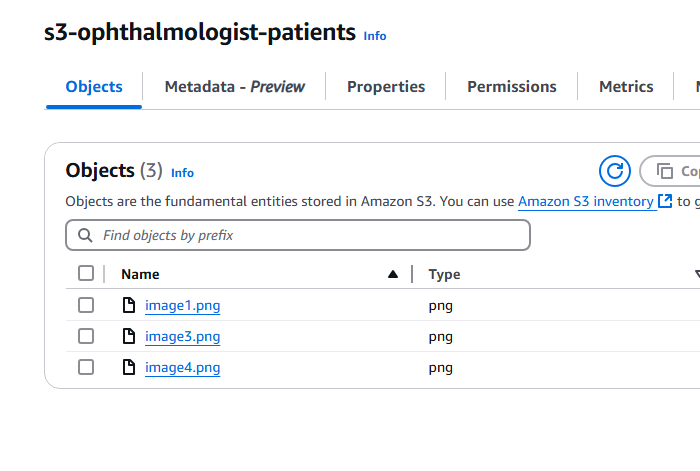

+++
date = '2025-05-12T19:33:27-06:00'
title = 'From an Eye Exam to a WhatsApp Bot'
draft = false
theme = 'LoveIt'
author = 'Alex Carrillo'
tags = ['software', 'side-quests']
featuredImage = 'whatsappbot.png'
featuredImagePreview = 'whatsappbot.png'
images = ['images/whatsappbot.png']
+++

Last week, I went to the ophthalmologist to get my vision checked. You know, just the usual: reading tiny letters on a chart, and the doctor asking if "this one or that one" looks clearer. 

As he was examining my eyes, we started chatting. At one point, he asked what I do for a living. I mentioned I work in software development, and suddenly he seemed more curious, kind of like when someone realizes you might be able to fix that annoying tech problem they’ve been silently suffering with.

**(Fortunately, he didn’t ask me to fix his printer — close call. 😅)**

Instead, he asked,

**“Hey, would it be too complicated to build something that sends images to patients via WhatsApp?”**

He explained to me that sometimes he loses track of which patients need to receive their eye scans, and other times he just forgets because of how busy his schedule gets.

He already works with a media agency that has a WhatsApp Business account, but none of them know how to do it.

Challenge accepted. 💪

Turns out, it wasn’t complicated at all.

A couple of hours later, I had a quick automation bot up and running, fetching images from S3 and sending them to phone numbers through the WhatsApp Business API.

---

## 🔗 1. Connect to AWS S3 to Download Images

Here we connect to an S3 bucket where the eye scan images are stored. We initiate a session with AWS and prepare a list of images to be sent.



```python
# S3 bucket setup
BUCKET_NAME = 's3-ophthalmologist-patients'
session = boto3.Session()
s3 = session.resource('s3')

# Images stored in S3
image_names = ['image1.png', 'image3.png', 'image4.png']


```

## 📇 2. Upload the images to WhatsApp (using the WhatsApp Business API via Facebook Graph)
We upload each image to WhatsApp’s media endpoint using the Graph API. This returns an image ID that we can later use to send the image in a message.

```python
VERSION = 'v21.0'
PHONE_NUMBER_ID = ''
USER_ACCESS_TOKEN = ''

url_template = f"https://graph.facebook.com/{VERSION}/{PHONE_NUMBER_ID}/media"
files = {"file": (image_name, open(image_name, 'rb'), 'image/png')}
payload = {
    "type": "image/png",
    "description": "Eye scan",
    "messaging_product": "whatsapp"
}
headers = {"authorization": f"Bearer {USER_ACCESS_TOKEN}"}

response = requests.post(url_template, data=payload, files=files, headers=headers)

if response.status_code == 200:
    image_id = response.json().get('id')
    print(f"Uploaded image '{image_name}' successfully. ID: {image_id}")

```
## 📇 3. Sends the image to the patient’s WhatsApp number
Now we just use the image ID and send it directly to the patient.

```python {linenos=inline}
RECIPIENT_PHONE_NUMBER = 'patient_phone_number_her
message_url = f"https://graph.facebook.com/{VERSION}/{PHONE_NUMBER_ID}/messages"
message_data = {
    'messaging_product': 'whatsapp',
    'recipient_type': 'individual',
    'to': RECIPIENT_PHONE_NUMBER,
    'type': 'image',
    'image': {
        'id': image_id
    }
}
message_response = requests.post(message_url, json=message_data, headers=header
if message_response.status_code == 200:
    print(f"Message sent successfully using image ID {image_id}.")
else:
    print(f"Failed to send message: {message_response.status_code} - {message_response.text}")

```

## 📇 4. Final Result

    
    <video playsinline style="border:solid;" height="500rem" width=100% controls autoplay>
        <source src="/blog/videos/whatsappbot.webm" type="video/webm">
    Your browser does not support the video tag.  
    </video>


---
## 🧠 Final Thoughts

What began as a simple conversation turned into a little side-quest. Who knows, maybe next time I visit, I’ll share this post, and we’ll explore the possibility of turning it into something real 😄